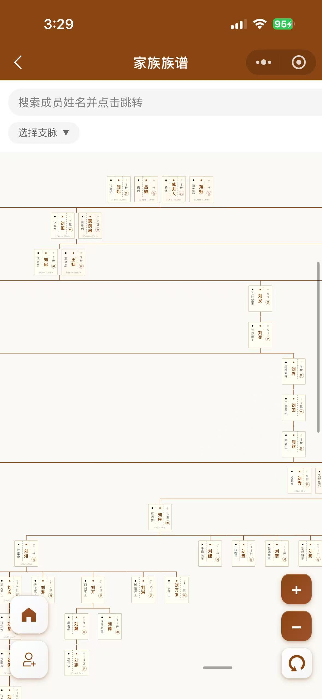
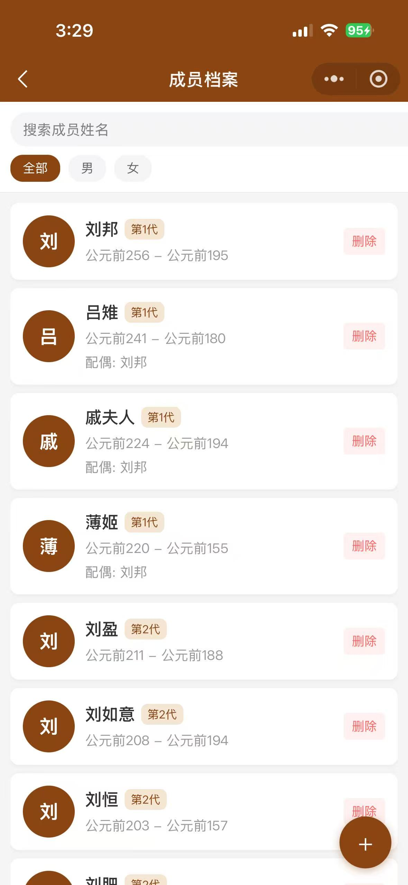
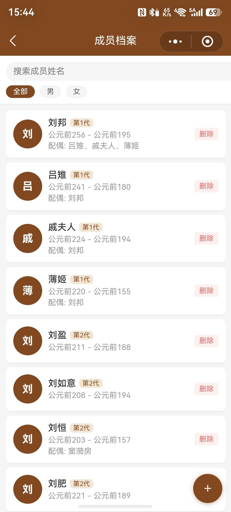
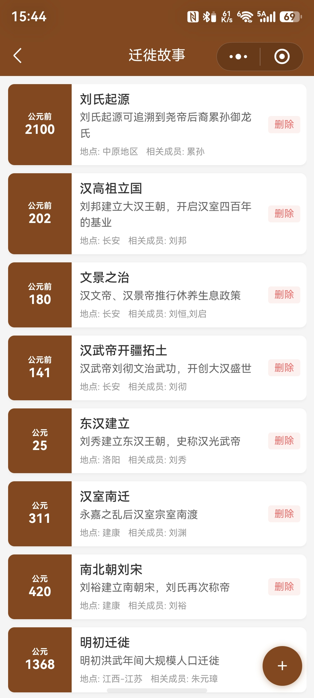
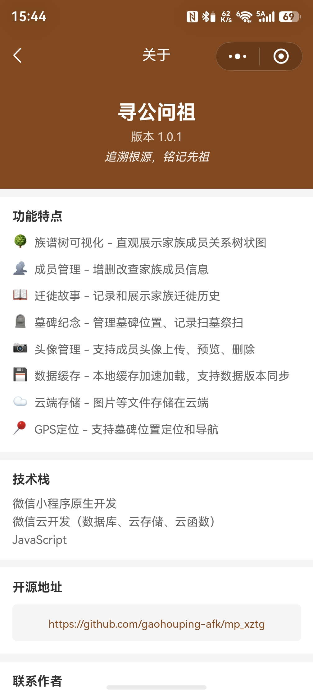

# 寻公问祖 - 家族族谱小程序


> 📱 寻公问祖 - 追溯根源，铭记先祖

## 演示截图

| 首页 | 族谱树 | 成员档案 |
|:---:|:---:|:---:|
|  |  |  |

| 迁徙故事 | 墓碑纪念 | 关于我们 |
|:---:|:---:|:---:|
|  |  |  |

一个基于微信云开发的家族族谱管理小程序，支持多家族管理、族谱树展示、成员管理、迁徙故事、墓碑纪念等功能。

## 版本更新

### v1.0.2 (当前版本)

**新增功能：多家族管理**
- 多家族支持 - 支持创建和管理多个家族，可随时切换
- 家族切换 - 首页支持快速切换当前查看的家族
- 家族成员权限 - 成员角色区分（族长、管理员、普通成员）
- 家族数据隔离 - 各家族数据独立，互不干扰
- 家族设置 - 支持修改家族名称、简介、公告等信息
- 邀请加入 - 生成邀请码邀请成员加入家族

**优化内容**
- 优化了家族模块的数据加载与更新逻辑
- 修复了编辑故事、墓碑、成员后返回列表不自动刷新的问题
- 完善了家族切换后数据的正确显示与缓存管理

### v1.0.1

**新增功能：墓碑纪念**
- 墓碑信息管理 - 添加、编辑、删除墓碑记录
- GPS定位 - 支持获取墓碑位置坐标
- 地图导航 - 一键跳转地图应用导航至墓碑位置
- 扫墓记录 - 记录每次扫墓祭扫的时间
- 墓碑类型 - 支持祖先墓、衣冠冢、纪念碑、牌位等多种类型
- 墓碑照片 - 支持上传和管理墓碑照片
- 成员关联 - 与成员档案关联，支持从成员页面添加墓碑

### v1.0.0
- 初始版本
- 族谱树可视化
- 成员管理
- 迁徙故事
- 头像管理

## 功能特点

- **多家族管理** - 支持创建、切换多个家族，家族数据完全隔离
- **族谱树可视化** - 直观展示家族成员关系树状图
- **成员管理** - 增删改查家族成员信息，支持头像上传
- **迁徙故事** - 记录和展示家族迁徙历史
- **墓碑纪念** - 管理墓碑位置，记录扫墓祭扫，支持GPS定位和导航
- **数据缓存** - 本地缓存加速加载，支持数据版本同步
- **云端存储** - 图片等文件存储在云端

## 技术栈

- 微信小程序原生开发
- 微信云开发（数据库、云存储、云函数）
- JavaScript

## 项目结构

```
miniprogram/
├── app.js                 # 小程序入口
├── app.json               # 小程序配置
├── app.wxss               # 全局样式
├── components/            # 自定义组件
│   └── familyTree/        # 族谱树组件
│       ├── familyTree.js
│       ├── familyTree.wxml
│       ├── familyTree.wxss
│       ├── tree-node.js
│       ├── tree-node.wxml
│       └── tree-node.wxss
└── pages/                 # 页面
    ├── index/              # 首页
    ├── familyTree/         # 族谱树页面
    ├── member/             # 成员列表
    ├── memberEdit/         # 成员编辑
    ├── story/              # 迁徙故事列表
    ├── storyDetail/        # 故事详情
    ├── storyEdit/          # 故事编辑
    ├── grave/              # 墓碑列表
    ├── graveDetail/        # 墓碑详情
    ├── graveEdit/          # 墓碑编辑
    └── about/              # 关于页面
```

## 快速开始

### 1. 注册微信小程序

前往 [微信公众平台](https://mp.weixin.qq.com/) 注册一个小程序。

### 2. 开通云开发

1. 登录小程序管理后台
2. 进入「云开发」控制台
3. 创建云开发环境（免费版即可）

### 3. 配置云开发

修改 `miniprogram/app.js` 中的环境 ID：

```javascript
wx.cloud.init({
  env: 'your-env-id'  // 替换为你的云开发环境 ID
})
```

### 4. 部署云函数

在微信开发者工具中，右键点击 `cloudfunctions` 文件夹，选择「上传并部署：云端安装依赖」。

如果没有 `cloudfunctions` 文件夹，需要在云开发控制台创建云函数。

### 5. 初始化数据库

首次部署需要初始化数据库集合：

1. 在云开发控制台手动创建以下集合：
   - `families` - 家族数据
   - `family_members` - 家族成员关系
   - `members` - 成员数据
   - `stories` - 迁徙故事
   - `graves` - 墓碑数据

或运行 initDB 云函数自动创建集合。

## 数据结构

### families 集合

| 字段 | 类型 | 说明 |
|------|------|------|
| _id | string | 自动生成唯一ID |
| name | string | 家族名称 |
| description | string | 家族简介 |
| announcement | string | 家族公告 |
| ownerId | string | 族长openid |
| memberCount | number | 成员数量 |
| inviteCode | string | 邀请码 |
| membersVersion | number | 成员数据版本号 |
| gravesVersion | number | 墓碑数据版本号 |
| storiesVersion | number | 故事数据版本号 |
| createTime | date | 创建时间 |
| updateTime | date | 更新时间 |

### family_members 集合

| 字段 | 类型 | 说明 |
|------|------|------|
| _id | string | 自动生成唯一ID |
| familyId | string | 家族ID |
| openid | string | 成员openid |
| nickname | string | 微信昵称 |
| avatar | string | 头像URL |
| role | string | 角色（owner/admin/member/viewer） |
| joinTime | date | 加入时间 |

### members 集合

| 字段 | 类型 | 说明 |
|------|------|------|
| _id | string | 自动生成唯一ID |
| familyId | string | 所属家族ID |
| name | string | 姓名 |
| gender | string | 性别（男/女） |
| generation | number | 代数 |
| birthYear | string | 出生年份 |
| deathYear | string | 逝世年份 |
| fatherId | string | 父亲ID |
| motherId | string | 母亲ID |
| spouses | array | 配偶ID数组 |
| rankTitle | string | 辈分称呼 |
| bio | string | 简介 |
| avatar | string | 头像云存储路径 |
| createTime | date | 创建时间 |
| updateTime | date | 更新时间 |

### stories 集合

| 字段 | 类型 | 说明 |
|------|------|------|
| _id | string | 自动生成唯一ID |
| familyId | string | 所属家族ID |
| title | string | 标题 |
| year | string | 年份 |
| location | string | 地点 |
| description | string | 简介 |
| content | string | 详细内容 |
| relatedMembers | string | 相关成员 |
| images | array | 图片路径数组 |
| createTime | date | 创建时间 |
| updateTime | date | 更新时间 |

### graves 集合

| 字段 | 类型 | 说明 |
|------|------|------|
| _id | string | 自动生成唯一ID |
| familyId | string | 所属家族ID |
| memberId | string | 关联的成员ID |
| graveType | string | 墓碑类型（ancestor/clothing/memorial/tablet/other） |
| location | string | 墓碑位置描述 |
| latitude | number | GPS纬度坐标 |
| longitude | number | GPS经度坐标 |
| description | string | 墓碑描述、碑文等 |
| photos | array | 墓碑照片路径数组 |
| visitCount | number | 累计扫墓次数 |
| visitDate | string | 上次扫墓日期 |
| visitTime | string | 上次扫墓时间 |
| createTime | date | 创建时间 |
| updateTime | date | 更新时间 |

## 开发说明

### 本地开发

1. 使用微信开发者工具打开项目
2. 确保已配置好云开发环境
3. 点击预览即可在手机或模拟器中运行

### 数据缓存

项目实现了本地缓存机制：

- 成员数据缓存（带版本号同步）
- 迁徙故事缓存（带版本号同步）
- 墓碑数据缓存（带版本号同步）

当云端数据更新时（版本号变化），自动刷新本地缓存。

## 开源地址

GitHub: https://github.com/gaohouping-afk/mp_xztg

## 开源协议

GNU GENERAL PUBLIC LICENSE

## 贡献指南

欢迎提交 Issue 和 Pull Request！